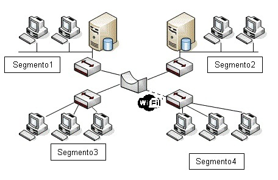
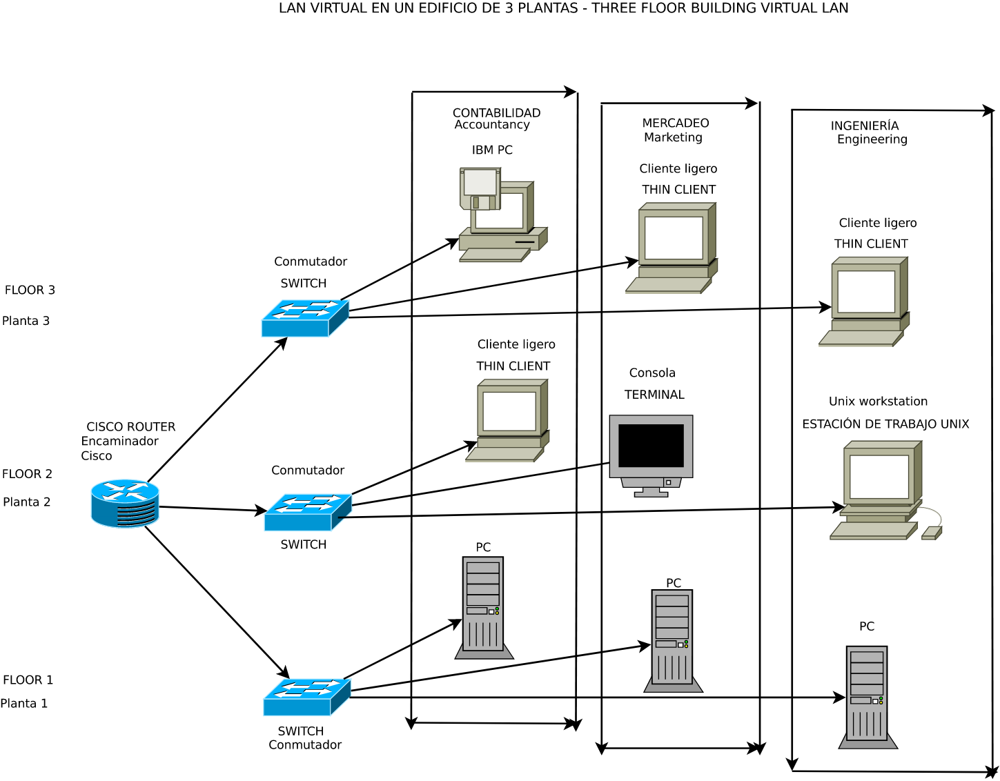

# Apuntes #2

# Clase: Semana 7, 22/03/24

## Redes (IC-7602).

### Estudiante: Sebastian Obando Paniagua - 2020065195

Entrega del Proyecto -> martes 26 de marzo

## Hubs

Un hub es un dispositivo básico de red que permite la conexión de varios dispositivos entre sí. Funciona retransmitiendo los datos recibidos en un puerto a todos los demás puertos. Sin embargo, presenta problemas de asignación de canal debido a que todas las computadoras tienen el mismo dominio de colisión. Esto provoca que mientras una computadora transmite, las demás no puedan hacerlo. Además, no permite establecer un circuito virtual para controlar el medio, lo que resulta en una comunicación por difusión. A pesar de ser económicos, los hubs solo funcionan en modo half-duplex, lo que ocasiona retrasos por las colisiones.

## Repetidores

Un repetidor en redes es un dispositivo que se utiliza para amplificar y retransmitir señales de red. Su función principal es extender la distancia de una red al regenerar las señales que recibe, lo que ayuda a superar la atenuación de la señal y a amplificarla para que pueda viajar más lejos a través de medios de transmisión como cables. Aunque los repetidores aumentan la amplitud de las señales, los WIFI repeaters pueden degradar la calidad de la señal y aumentar la congestión de red.

## Bridge

Un bridge es un dispositivo de red que se utiliza para conectar dos redes locales (LAN) separadas y permitirles comunicarse entre sí. Funciona examinando las direcciones MAC de los paquetes de datos que recibe y decidiendo si reenviarlos o no a la otra red. Los bridges son más inteligentes que los hubs, ya que toman decisiones basadas en las direcciones MAC, pero son menos sofisticados que los switches. Además, los bridges pueden definir políticas de seguridad y son transparentes en la red.

## Switches

Los switches son dispositivos de red que se utilizan para conectar múltiples dispositivos en una red local (LAN). Analizan las direcciones MAC de los paquetes de datos que reciben y utilizan esta información para enviar los datos solo al puerto del switch al que está conectado el dispositivo de destino, en lugar de retransmitir los datos a todos los puertos como los Hubs. Los switches son más eficientes que los hubs, ya que reducen la cantidad de colisiones y maximizan el uso del ancho de banda. También permiten la comunicación directa entre dispositivos y pueden operar en modo full-duplex.

## VLANs

Las VLANs (Virtual Local Area Networks) son redes lógicas creadas dentro de una red física, permitiendo que los dispositivos se agrupen lógicamente aunque estén físicamente separados. Ayudan a aislar el tráfico de red y mejorar la seguridad al separar grupos de dispositivos. Además, permiten un mejor uso del ancho de banda y una gestión más eficiente de la red al definir políticas de acceso y segmentar el tráfico.

## Redes inalámbricas

Las redes inalámbricas permiten la comunicación entre dispositivos sin la necesidad de cables físicos. Hay dos modos de operación en redes wireless: Ad-hoc y Access Point. En el modo Ad-hoc, los dispositivos inalámbricos se comunican directamente entre sí, mientras que en el modo Access Point, un dispositivo actúa como un punto de acceso central que coordina la comunicación entre todos los dispositivos inalámbricos en la red. El uso de redes inalámbricas presenta desafíos como la pérdida de tramas y la congestión del canal, pero también ofrece flexibilidad y movilidad para los usuarios.
