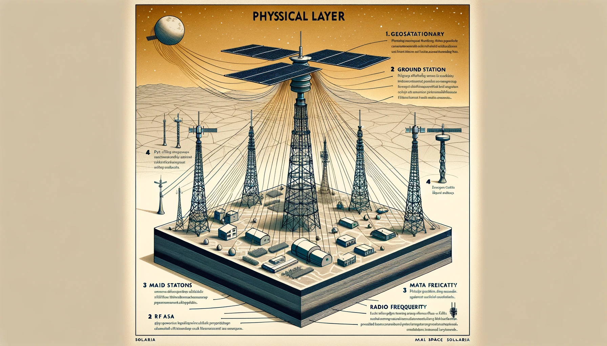

# Examen: Sebastian Obando Paniagua

# Carne: 2020065195

## Pregunta #1

### Justificación de la Capa Física Seleccionada:

Para garantizar comunicaciones eficientes en Namiapí, proponemos una combinación de las siguientes tecnologías para la capa física:

#### Enlaces Satelitales Geosincrónicos:

- **Funcionalidad**: Estos enlaces proporcionarán una conexión primaria a la red de satélites geoestacionarios desplegados por Deep Space 13, asegurando comunicación con la Tierra y dentro de Solaria.
- **Justificación**: Los satélites geoestacionarios permiten una cobertura constante sobre Namiapí y pueden gestionar grandes áreas con infraestructura limitada en el terreno.

#### Estaciones Base de Microondas:

- **Funcionalidad**: Se utilizarán para la comunicación terrestre de largo alcance en Namiapí. Las estaciones base se colocarán en puntos estratégicos para maximizar la cobertura y reducir la latencia.
- **Justificación**: Las microondas permiten una transmisión de datos a alta velocidad sobre distancias largas sin la necesidad de un tendido extenso de cables. Son ideales para terrenos similares a Costa Rica, con diversas elevaciones y vegetación densa.

#### Fibra Óptica:

- **Funcionalidad**: Implementación de una red troncal de fibra óptica para conectar las principales estaciones base de microondas y centros de datos.
- **Justificación**: La fibra óptica ofrece una alta capacidad de transmisión de datos y es altamente fiable. Aunque su instalación inicial puede ser costosa y laboriosa, es fundamental para una infraestructura robusta y de baja latencia.

#### Redes de Radiofrecuencia (RF) de Banda Ancha:

- **Funcionalidad**: Se utilizarán para la última milla, proporcionando acceso a usuarios finales en áreas urbanas y rurales.
- **Justificación**: Las redes RF de banda ancha pueden cubrir áreas extensas con relativa facilidad y rapidez en la implementación, lo cual es crucial para el cronograma de dos años.

### Diagrama de Apoyo:


La imagen muestra la infraestructura de comunicaciones en Namiapí, que incluye:

- Satélite Geoestacionario: Proporciona conexión primaria a Deep Space 13.
- Estaciones Terrestres: Torres de comunicación en Solaria para largo alcance.
- Red de Fibra Óptica: Conecta las estaciones terrestres y centros de datos.
- Torres de Radiofrecuencia: Proveen conectividad de última milla en áreas urbanas y rurales.
- Mapa de Namiapí: Contextualiza la ubicación de las infraestructuras.

## Pregunta #2

El diseño contempla dos enfoques: uno con tamaño de trama variable y otro con tamaño fijo, ambos cumpliendo con los requisitos de eficiencia, seguridad y orden en la entrega de datos.

### Propuesta de Trama con Tamaño Variable

#### Estructura del Header:

- **Dirección de Destino (48 bits / 6 octetos)**: Identifica la dirección física o lógica del destinatario.
- **Dirección de Fuente (48 bits / 6 octetos)**: Identifica la dirección física o lógica del remitente.
- **Tipo de Trama (8 bits)**: Diferencia entre diversos tipos de tramas (datos, control, ACK).
- **Longitud del Payload (8 bits)**: Define el tamaño del payload, permitiendo variabilidad hasta 160 bytes.
- **Número de Secuencia (16 bits)**: Asegura la entrega secuencial de las tramas.
- **Checksum (16 bits)**: Verifica la integridad del contenido de la trama.

**Payload**: Capacidad variable de 0 a 160 octetos, dependiendo del contenido a transmitir.

**Tamaño total del Header**: 144 bits o 18 octetos.

**Tamaño total de la trama**: 18 octetos de header + hasta 160 octetos de payload.

### Propuesta de Trama con Tamaño Fijo

#### Estructura del Header:

- **Dirección de Destino (48 bits / 6 octetos)**
- **Dirección de Fuente (48 bits / 6 octetos)**
- **Tipo de Trama (8 bits)**
- **Número de Secuencia (16 bits)**
- **Checksum (16 bits)**

**Payload**: Tamaño fijo de 160 octetos, maximizando la capacidad de datos permitida por trama.

**Tamaño total del Header**: 136 bits o 17 octetos.

**Tamaño total de la trama**: 17 octetos de header + 160 octetos de payload = 177 octetos.

### Análisis y Justificación

- **Optimización del Header**: Ambas propuestas buscan minimizar el tamaño del header para hacer un uso eficiente del espacio de la trama, considerando la necesidad de mantener bajo el overhead en un medio con limitaciones.
- **Encriptación de Datos**: Se sugiere la implementación de encriptación con llave pública/privada para asegurar la confidencialidad de los datos transmitidos. Esta encriptación se manejaría a nivel del payload y es independiente del tamaño del payload reportado en el header.
- **Control de Entrega y Verificación**: El número de secuencia y el checksum son críticos para garantizar que las tramas se entreguen en orden y sin errores, respectivamente, aspectos fundamentales en un medio propenso a interferencias.
- **Flexibilidad vs. Estabilidad**: La trama de tamaño variable ofrece flexibilidad para ajustarse a diferentes tamaños de datos, mientras que la trama de tamaño fijo proporciona uniformidad y simplificación en el procesamiento y diseño del sistema.

## Pregunta #3

Aqui se describe un protocolo de capa de enlace de datos para el Proyecto Gemini, que convierte tramas Ethernet clásicas en tramas Gemini con restricciones específicas.

## Descripción del Protocolo

### Restricciones y Reglas

1. **Tramas Gemini**:

   - Máximo de 140 bytes para los datos.
   - Tamaño fijo, rellenando con ceros si hay menos de 140 bytes.
   - Campos adicionales:
     - `numero_gemini` (4 bits): Número consecutivo de la trama Gemini.
     - `tamano_gemini` (7 bits): Tamaño del payload (0-140 bytes).

2. **Proceso de Envío y Recepción**:
   - **Envío**: Dividir la trama Ethernet en fragmentos de 140 bytes y enviar todas las tramas Gemini sin esperar confirmación, pero verificar la recepción de cada una para garantizar la entrega completa.
   - **Recepción**: Verificar y ensamblar las tramas Gemini para reconstruir la trama Ethernet original, enviando confirmación por cada trama recibida correctamente.

### Pseudocódigo del Protocolo

#### Estructura de la Trama Gemini

```c
#define MAX_PAYLOAD 140
#define TIMEOUT 1000

typedef struct {
    uint8_t preambulo[7];
    uint8_t sfd;
    uint8_t destino[6];
    uint8_t origen[6];
    uint16_t tipo_longitud;
    uint8_t numero_gemini;
    uint8_t tamano_gemini;
    uint8_t datos[MAX_PAYLOAD];
    uint32_t crc;
} trama_gemini;

void geminiSender(void) {
    buffer trama_ethernet;
    from_ethernet(&trama_ethernet);

    int num_tramas = (trama_ethernet.length + MAX_PAYLOAD - 1) / MAX_PAYLOAD;
    int numero_trama = 0;

    for (int i = 0; i < trama_ethernet.length; i += MAX_PAYLOAD) {
        trama_gemini trama;
        trama.tipo_longitud = trama_ethernet.tipo_longitud;
        trama.numero_gemini = numero_trama & 0xF;  // Número Gemini de 4 bits
        trama.tamano_gemini = min(MAX_PAYLOAD, trama_ethernet.length - i);  // Tamaño Gemini de 7 bits

        // Copiar datos a la trama Gemini
        memcpy(trama.datos, trama_ethernet.datos + i, trama.tamano_gemini);

        // Rellenar con ceros si el tamaño es menor a MAX_PAYLOAD
        if (trama.tamano_gemini < MAX_PAYLOAD) {
            memset(trama.datos + trama.tamano_gemini, 0, MAX_PAYLOAD - trama.tamano_gemini);
        }

        bool confirmado = false;
        while (!confirmado) {
            to_physical_layer(&trama);  // Enviar trama a la capa física
            start_timer();  // Iniciar el temporizador
            buffer evento;
            wait_for_event(&evento);  // Esperar evento (confirmación o expiración del temporizador)

            if (evento.tipo == TIMER_EXPIRED) {
                // Reenviar la trama si el temporizador expira
            } else if (evento.tipo == FRAME_ARRIVAL) {
                trama_gemini trama_ack;
                from_physical_layer(&trama_ack);  // Obtener la trama de confirmación

                // Verificar si es la confirmación de la trama enviada
                if (trama_ack.tipo_longitud == ACK && trama_ack.numero_gemini == numero_trama) {
                    confirmado = true;
                }
            }
        }
        numero_trama++;
    }
}
void geminiReceiver(void) {
    buffer trama_ethernet;
    trama_gemini tramas[MAX_FRAMES];
    int conteo_tramas = 0;

    while (true) {
        buffer evento;
        wait_for_event(&evento);  // Esperar evento (llegada de trama)

        if (evento.tipo == FRAME_ARRIVAL) {
            trama_gemini trama;
            from_physical_layer(&trama);  // Obtener trama de la capa física

            if (verify_data(&trama)) {
                // Almacenar trama recibida
                tramas[trama.numero_gemini] = trama;

                // Enviar confirmación de recepción
                trama_gemini trama_ack;
                trama_ack.tipo_longitud = ACK;
                trama_ack.numero_gemini = trama.numero_gemini;
                to_physical_layer(&trama_ack);

                conteo_tramas++;

                // Si se han recibido todas las tramas, ensamblar la trama Ethernet
                if (conteo_tramas == num_tramas) {
                    for (int i = 0; i < conteo_tramas; i++) {
                        memcpy(trama_ethernet.datos + i * MAX_PAYLOAD, tramas[i].datos, tramas[i].tamano_gemini);
                    }
                    to_ethernet(&trama_ethernet);  // Entregar trama Ethernet completa
                    conteo_tramas = 0;
                }
            } else {
                // Manejar verificación negativa de datos (enviar negativa o ignorar)
            }
        }
    }
}
```

## Explicación

1. **geminiSender**:

   - **Obtener trama Ethernet**: Utiliza `from_ethernet` para recibir una trama Ethernet clásica.
   - **Dividir trama**: Calcula el número de tramas Gemini necesarias para fragmentar la trama Ethernet clásica en fragmentos de máximo 140 bytes.
   - **Construir y enviar tramas Gemini**:
     - Para cada fragmento, construye una trama Gemini, rellenando los campos `numero_gemini` y `tamano_gemini`.
     - Copia los datos del fragmento y, si es necesario, rellena con ceros.
     - Envía la trama Gemini a la capa física y espera la confirmación de recepción.
     - Si no se recibe confirmación (temporizador expira), se reenvía la trama.

2. **geminiReceiver**:
   - **Esperar tramas Gemini**: Utiliza `wait_for_event` para esperar la llegada de tramas Gemini.
   - **Verificar y almacenar tramas**:
     - Al recibir una trama, verifica los datos con `verify_data`.
     - Si la verificación es positiva, almacena la trama y envía una confirmación de recepción.
     - Si se han recibido todas las tramas necesarias para completar la trama Ethernet, las ensambla y la entrega utilizando `to_ethernet`.

# Pregunta #4

## Incidente con Radios Walkie Talkie en 1993

## Descripción del Incidente

En 1993, en Costa Rica, un niño recibió unos Radios Walkie Talkie como regalo. Durante una visita a Cristo Rey de Alajuela, cerca del Aeropuerto Juan Santamaría, el niño y su prima transmitieron canciones del programa de televisión "Nube Luz" usando los Walkie Talkies. Sin darse cuenta, interfirieron con la comunicación de un operador aéreo del aeropuerto, causando molestia y preocupación por la invasión de una frecuencia importante.

## Explicaciones

### ¿Por qué se presentó este incidente desde un punto de vista técnico?

El incidente ocurrió porque los Radios Walkie Talkie utilizados por los niños operaban en una frecuencia que coincidía o se solapaba con una frecuencia utilizada por el aeropuerto para las comunicaciones aéreas. Los Walkie Talkies, aunque de baja potencia, fueron capaces de interferir con las comunicaciones críticas debido a la cercanía del aeropuerto y la potencia suficiente para ser captados.

### ¿Por qué es necesaria la regulación de uso de frecuencias?

La regulación del uso de frecuencias es crucial para evitar interferencias entre diferentes servicios y garantizar que las comunicaciones importantes, como las de emergencia, seguridad pública y aviación, no se vean interrumpidas. La asignación de frecuencias específicas para diferentes tipos de servicios permite un uso ordenado y eficiente del espectro radioeléctrico, minimizando conflictos y asegurando la coexistencia de múltiples sistemas de comunicación.

### ¿Por qué se debe certificar los dispositivos y limitar su frecuencia de transmisión?

La certificación de dispositivos y la limitación de sus frecuencias de transmisión garantizan que los equipos cumplan con los estándares técnicos y legales para operar de manera segura y sin causar interferencias perjudiciales. Esto asegura que los dispositivos no operen en frecuencias reservadas para servicios críticos y que su potencia de transmisión esté dentro de los límites permitidos para evitar interferencias no deseadas.

### ¿Por qué la privacidad va de la mano con las redes, especialmente en medios inalámbricos?

En medios inalámbricos, las señales pueden ser captadas por cualquier receptor en el rango de transmisión, lo que hace que la información transmitida esté expuesta a posibles interceptaciones. La privacidad es fundamental para proteger la confidencialidad de las comunicaciones y evitar que terceros no autorizados accedan a información sensible. Las medidas de seguridad, como la encriptación y la autenticación, son esenciales para proteger la privacidad en redes inalámbricas.

### Solución para evitar este problema en 1993

Para evitar problemas similares en 1993, se podrían tomar las siguientes medidas:

1. **Educación y Concienciación**: Informar a los usuarios, especialmente a los niños y sus padres, sobre el uso adecuado de los dispositivos de comunicación y la importancia de respetar las frecuencias asignadas.
2. **Regulación y Supervisión**: Asegurar que todos los dispositivos de comunicación disponibles en el mercado cumplan con las normativas de frecuencias y estén adecuadamente certificados.
3. **Diseño de Dispositivos**: Fabricar dispositivos Walkie Talkie con frecuencias preconfiguradas y restringidas a bandas específicas designadas para uso general y recreativo, lejos de las frecuencias críticas de comunicación.
4. **Campañas Informativas**: Desarrollar campañas informativas sobre la correcta utilización de equipos de comunicación y la importancia de no interferir con las frecuencias de servicios esenciales como la aviación.

Estas medidas ayudarían a prevenir incidentes de interferencia y a garantizar la seguridad y eficiencia en el uso del espectro radioeléctrico.

### Referencias

1. **Tanenbaum, A.**. (2003). _Computer Networks_ (4ta edición). Prentice Hall.

2. IONOS Digital Guide. (2023). Capa Física: Introducción y Conceptos Básicos. Recuperado de https://www.ionos.es/digitalguide/servidores/know-how/capa-fisica/

3. Euroinnova. (2023). Capa Física del Modelo OSI: Conceptos y Aplicaciones. Recuperado de https://www.euroinnova.com.pr/blog/latam/capa-fisica-modelo-osi

4. OpenAI. (2024). ChatGPT (versión GPT-4) [Modelo de lenguaje]. OpenAI. Disponible en https://www.openai.com
